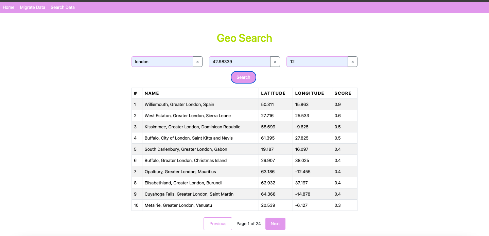

# React Application

This is a React application project. Below are the instructions to set up, start, and build the project.




## Prerequisites

Ensure you have the following installed on your machine:

- **Node.js**: v20.12.2
- **npm**: v10.5.0

## Getting Started

### 1. Clone the Repository

First, clone the repository to your local machine using the following command:

```bash
git clone <repository-url>
cd <repository-directory>
```

### 2. Install dependencies
```
  npm install
  ```

### 3. Running the Application
To start the application, run the following command:
 ```
  npm start
  ```

Runs the app in the development mode.
Open [http://localhost:3000](http://localhost:3000) to view it in your browser.

### 4. build the app
 ```
  npm run build
  ```

Builds the app for production to the `build` folder.\
It correctly bundles React in production mode and optimizes the build for the best performance.

